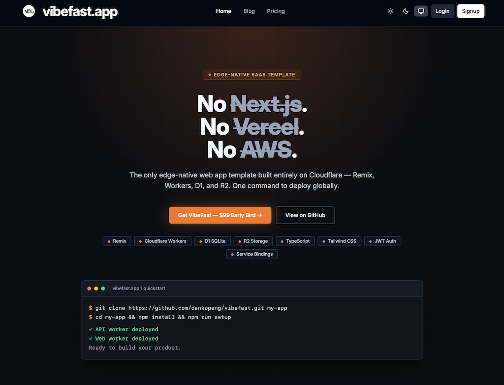

# vibefast.app 🚀

[English](./README.md) · [繁中](./README-zh.md) · [日本語](./README-jp.md) · [Español](./README-es.md) · [Português (BR)](./README-pt-br.md)

**No necesitas saber programar para crear una aplicación web real.**  
**3 comandos. Desplegado globalmente en 5 minutos.**

Curso open source de vibefast.app + vibefast.app template full-stack de pago. Del aprendizaje al lanzamiento, todo en un solo lugar.

⭐ Más de 7,000 desarrolladores siguiendo este viaje  
📚 25 tutoriales prácticos, del concepto al despliegue  
⚡ 3 comandos para despliegue global  
🌍 5 idiomas: 繁中 · English · 日本語 · Español · Português (BR)

<p align="center">
  
</p>

-----

## Qué es vibefast.app

vibefast.app tiene dos partes que resuelven el mismo problema:

### vibefast.app course gratuito de código abierto

Antes cobraba **$2,000 USD** por persona para enseñar este contenido. Ahora es completamente gratis.

¿Nunca has escrito una línea de código? No hay problema. Este curso fue diseñado para ti.

25 tutoriales prácticos que cubren el stack completo de Cloudflare, flujos de trabajo con IA y el camino completo desde cero hasta el despliegue. Sigue el mapa de ruta y lanza tu primera aplicación web real en seis semanas.

⭐ Si este curso te ayuda a construir más rápido — **[Dale Star para seguir las actualizaciones](https://github.com/vibefast-app/vibefast-docs)**

👉 **[Lee el curso completo gratis — vibefast.app/learn](https://vibefast.app/learn)**

### vibefast.app template full-stack de pago

El curso te enseña cómo hacerlo. La plantilla te permite hacerlo más rápido.

Autenticación, base de datos, pagos, email, analytics — todo configurado. Tres comandos y tu aplicación web está en vivo en más de 300 nodos globales.

```bash
git clone https://github.com/vibefast-app/vibefast.git my-app
cd my-app && npm install
npm run setup
```

Sin Next.js. Sin Vercel. Sin AWS. Una plataforma, una factura, cero costos de transferencia.

Después de la compra, recibirás inmediatamente una invitación a GitHub para acceder al repositorio privado. Todas las actualizaciones futuras son tuyas, para siempre, sin costo adicional.

-----

## Experiméntalo ahora mismo

Otras templates solo te dan un sitio de demostración.

**La live demo de vibefast.app es su propio sitio web en producción.**

Este sitio está construido completamente con la vibefast.app template. Tráfico real, usuarios reales, cada día. Lo que ves es exactamente lo que la template puede producir.

Regístrate gratis, entra al Dashboard y ve 7 días de datos de tráfico real. Auth, Dashboard, Blog CMS, Media Library, Analytics — todo ahí, listo para que lo explores.

👉 **[Pruébalo gratis — vibefast.app](https://vibefast.app)**

-----

## Obtén la vibefast.app template

El precio early bird es para los primeros en creer en esto.

**Early bird US$99 · Sube a US$199 el 1 de junio de 2026**

Pago único · Actualizaciones de por vida · Acceso inmediato al repositorio privado de GitHub

👉 **[Comprar ahora — vibefast.app/pricing](https://vibefast.app/pricing)**

-----

## Mapa del curso

### Prólogo

- [x] 00 — [Por qué empecé a construir productos en serio a los 50](./es/00-why-i-started-at-50-es.md)

-----

### Semana 1–2: Fundamentos

- [x] 01 — [¿Qué es Vibe Coding?](./es/01-what-is-vibecoding-es.md)
- [x] 02 — [Configurando tu entorno de Vibe Coding desde cero](./es/02-how-to-setup-vibecoding-environment-es.md)
- [x] 03 — [¿Qué son las APIs, el frontend y el backend?](./es/03-what-is-api-frontend-backend-es.md)
- [x] 04 — [¿Qué es la autenticación JWT?](./es/04-what-is-jwt-authentication-es.md)

-----

### Semana 2–3: Stack de Cloudflare

- [x] 05 — [Por qué Cloudflare es la mejor opción para Vibe Coding](./es/05-the-best-way-to-vibecoding-on-cloudflare-es.md)
- [x] 06 — [Cloudflare Workers vs Servidores tradicionales](./es/06-cloudflare-workers-vs-traditional-server-es.md)
- [x] 07 — [Introducción a la base de datos Cloudflare D1](./es/07-cloudflare-d1-database-tutorial-es.md)
- [x] 08 — [Cloudflare R2 vs AWS S3](./es/08-cloudflare-r2-vs-aws-s3-es.md)
- [x] 09 — [Variables de entorno y gestión de secretos](./es/09-environment-variables-and-secrets-es.md)

-----

### Semana 3–4: Herramientas y flujo de trabajo

- [x] 10 — [Introducción a Git y GitHub para principiantes](./es/10-git-and-github-version-control-es.md)
- [x] 11 — [Diseñando interfaces frontend con IA](./es/11-ai-frontend-design-with-cursor-es.md)
- [x] 12 — [¿Qué son los dominios y el DNS?](./es/12-domain-and-dns-setup-guide-es.md)
- [x] 13 — [Seguridad básica para Vibe Coders](./es/13-security-basics-for-vibe-coders-es.md)

-----

### Semana 4–5: Técnicas avanzadas

- [x] 14 — [Cómo discutir tu proyecto con IA antes de programar](./es/14-how-to-discuss-with-ai-before-coding-es.md)
- [x] 15 — [Cómo llevo una función de idea a despliegue con Cursor](./es/15-cursor-workflow-from-idea-to-deploy-es.md)
- [x] 16 — [5 errores que cometí con Vibe Coding](./es/16-vibe-coding-common-mistakes-es.md)
- [x] 17 — [Cómo crear un plan de trabajo para Vibe Coding](./es/17-vibe-coding-work-plan-and-ai-plan-mode-es.md)
- [x] 18 — [No entres en pánico con los errores: usando IA para depurar](./es/18-debug-and-errors-es.md)

-----

### Semana 5–6: Elección de tecnología y mundo real

- [x] 19 — [Eligiendo tu stack: Cloudflare vs Vercel vs AWS](./es/19-cloudflare-vs-vercel-vs-aws-es.md)
- [x] 20 — [Guía completa de pagos con Stripe](./es/20-stripe-payment-complete-guide-es.md)
- [x] 21 — [Cómo escribir tests con IA](./es/21-ai-testing-guide-es.md)
- [x] 22 — [SEO básico: que Google encuentre tu producto](./es/22-seo-basics-for-indie-makers-es.md)
- [x] 23 — [Analytics y seguimiento de usuarios](./es/23-analytics-and-user-tracking-es.md)
- [x] 24 — [Caso de estudio: construyendo un SaaS con la vibefast.app template](./es/24-saas-case-study-es.md)
- [x] 25 — [Caso de estudio: construyendo un e-commerce con la vibefast.app template](./es/25-ecommerce-case-study-es.md)

-----

## Enlaces rápidos

- [Guía de Inicio Rápido](./quickstart-es.md) — De clonar a producción en 3 comandos
- [Preguntas Frecuentes](./faq-es.md) — Precios, licencia, stack técnico y soporte

-----

## Licencia

El contenido del tutorial está licenciado bajo [CC BY-NC-SA 4.0](https://creativecommons.org/licenses/by-nc-sa/4.0/) (Atribución, No Comercial, Compartir Igual).

La vibefast.app template comercial es **software propietario** y **no está incluida** en este repositorio.

-----

## Autor

**Danko Peng**

20 años en los negocios. Empecé a programar en serio a los 50.  
Construí lo que estás viendo ahora mismo con IA y Cloudflare.

Si yo pude, tú también puedes.

- X: [@dankopeng](https://x.com/dankopeng)
- Threads: [@dankopeng](https://threads.net/@dankopeng)
- Website: [vibefast.app](https://vibefast.app)
