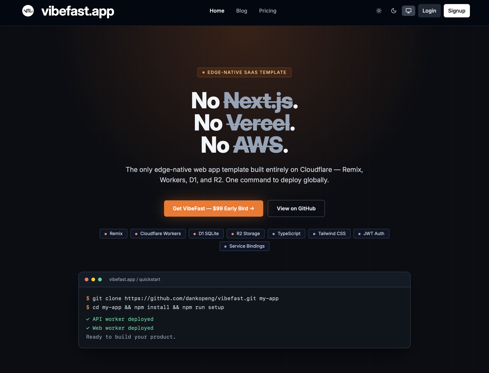
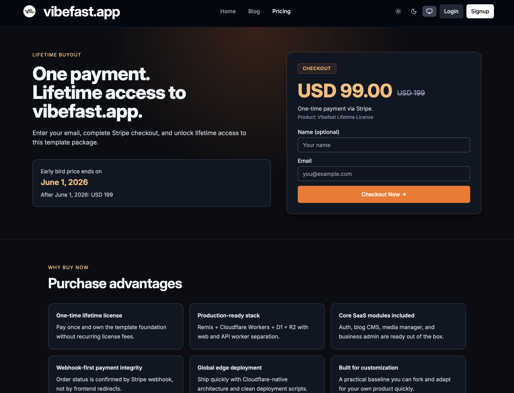

# VibeFast

Build real web apps with Vibe Coding.

**Ship a real web app in 3 commands.**

⭐ 7,000+ developers following the journey  
⚡ From clone → global deployment in minutes  
🌍 Cloudflare-native architecture  
💳 Auth · CMS · Payments · Analytics included  

⭐ If this repo helps you build faster — **star it to stay updated**

<p align="center">
  
</p>

VibeFast is a Cloudflare-native full-stack starter kit and free course for builders exploring Vibe Coding — using AI coding workflows to build and ship modern web apps and SaaS faster.

## Stack

[](https://vibefast.app)
[](https://remix.run)
[](https://workers.cloudflare.com)
[](https://turbo.build)

[](https://stripe.com)
[](https://resend.com)
[](https://developers.cloudflare.com/d1)
[](https://developers.cloudflare.com/r2)

# VibeFast 🚀

> **The edge-native web app template built entirely on Cloudflare.**  
> Remix · Workers · D1 · R2 · No Next.js · No Vercel · No AWS


[](https://vibefast.app)
[](https://remix.run)
[](https://workers.cloudflare.com)
[](https://turbo.build)

[](https://stripe.com)
[](https://resend.com)
[](https://developers.cloudflare.com/d1)
[](https://developers.cloudflare.com/r2)
[](https://vibefast.app)

[中文版](./README-zh.md) | [Live Demo](https://vibefast.app) | [Buy — $99 Early Bird](https://vibefast.app/#pricing) (ends Jun 1)



-----

## Get Your App Live in 3 Commands

```bash
git clone https://github.com/vibefast-app/vibefast.git my-app
cd my-app && npm install
npm run setup
```

That’s it. `npm run setup` handles everything automatically:

- Cloudflare login
- D1 database creation + bootstrap SQL
- JWT secret generation
- Deploy both Workers to production

Your app is live on Cloudflare’s global edge network. 300+ locations. Sub-millisecond cold starts.

-----

## What’s Included

Everything you need to ship a complete web app — wired together and ready to go.

### Core Architecture

- ✅ **Remix** frontend on Cloudflare Workers — SSR, nested routing, web standards
- ✅ **Cloudflare Workers API** — TypeScript backend at the edge
- ✅ **Cloudflare D1** — SQLite database, auto schema on first deploy
- ✅ **Cloudflare R2** — S3-compatible storage, zero egress fees
- ✅ **Service Binding** — frontend talks to backend internally, zero CORS config
- ✅ **Bearer JWT Auth** — stateless authentication, auto-generated secret
- ✅ **Turborepo Monorepo** — frontend, API, shared packages in one repo

### Built-in Modules

- ✅ **User auth** — registration, login, logout, protected routes
- ✅ **Admin dashboard** — manage users, content, and orders
- ✅ **Blog CMS** — create, edit, publish posts with categories
- ✅ **Media library** — upload and manage files via R2
- ✅ **Stripe payments** — one-time checkout for digital products, webhook pre-configured
- ✅ **Resend email** — transactional emails (purchase confirmation, admin notification)
- ✅ **Pageview analytics** — built-in traffic tracking, no third-party needed
- ✅ **One-command setup** — `npm run setup` bootstraps and deploys everything
- ✅ **All future updates** — lifetime access, private repo

-----

## Get VibeFast

**$99 early bird** — until June 1, 2026. Price goes up to $199 after that.

One-time payment. Lifetime access. Private GitHub repo. All future updates included.

👉 **[vibefast.app](https://vibefast.app)**

The site itself is built on VibeFast. Sign up free to explore the live dashboard — real 7-day traffic data, your registration number — before you buy. What you see is what you get.



-----

## Free VibeFast Template Docs

Want to understand the VibeFast template before buying? Start here.

|# |Doc|
|--|---|
|01|[VibeFast Docs Home](./vibefast-docs/en/index.md)|
|02|[Quickstart: Launch Your App in 3 Commands](./vibefast-docs/en/quickstart.md)|
|03|[Why Cloudflare Full-Stack](./vibefast-docs/en/why-cloudflare-fullstack.md)|
|04|[Why Monorepo](./vibefast-docs/en/why-monorepo.md)|
|05|[FAQ](./vibefast-docs/en/faq.md)|
|06|[Changelog](./vibefast-docs/en/changelog.md)|

More docs added over time. ⭐ Star to follow updates.

-----

## Free Vibe Coding Tutorials

New to vibe coding or Cloudflare? Start here.

|# |Article                                                                                         |
|--|------------------------------------------------------------------------------------------------|
|01|[What Is Vibe Coding? A Beginner-Friendly Guide](./vibe-coding-docs/en/01-what-is-vibecoding.md)|
|02|[The Best Way to Vibe Coding on Cloudflare](./vibe-coding-docs/en/02-the-best-way-to-vibecoding-on-cloudflare.md)|

More tutorials added regularly. ⭐ Star to follow along.

-----

## About

Built by **Danko Peng** — 50-year-old solopreneur building in public with AI + Cloudflare.

- X: [@dankopeng](https://x.com/dankopeng)
- Product: [vibefast.app](https://vibefast.app)

-----

## License

Template source code: Commercial license — see [LICENSE](./LICENSE).  
Tutorial content in `/vibe-coding-docs`: MIT.
