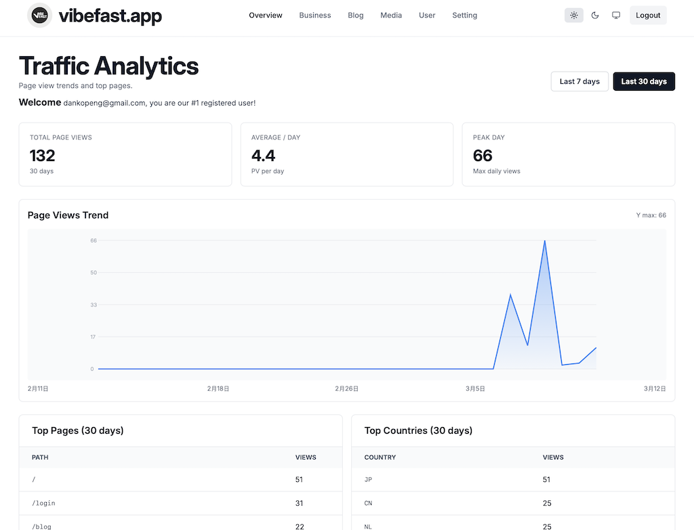
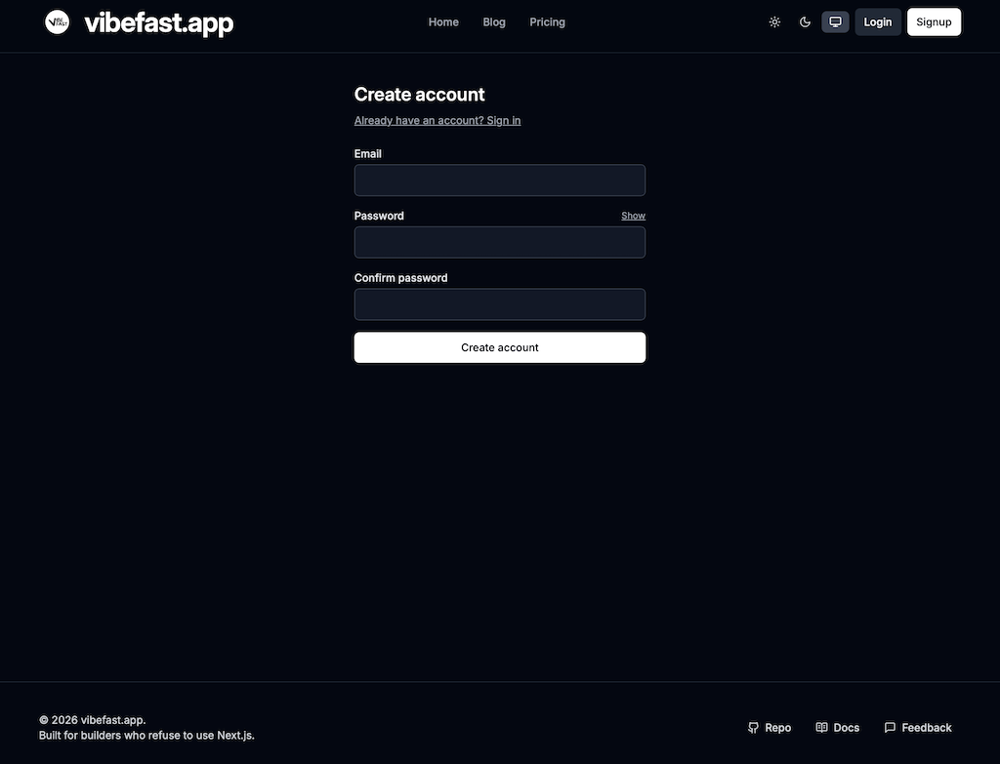
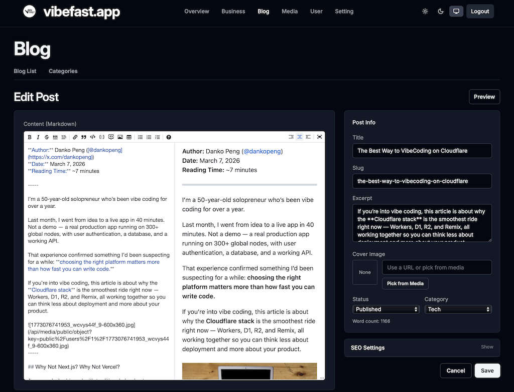

# vibefast.app Guia de Início Rápido

[English](./quickstart.md) · [繁中](./quickstart-zh.md) · [日本語](./quickstart-jp.md) · [Español](./quickstart-es.md) · [Português (BR)](./quickstart-pt-br.md)

**Atualizado:** Março 2026  
**Tempo de leitura:** ~5 minutos

-----

## Do clone ao ar em 3 comandos

```bash
git clone https://github.com/vibefast-app/vibefast.git my-app
cd my-app && npm install
npm run setup
```

É isso.

`npm run setup` é o núcleo da experiência do vibefast.app template. Ele cuida automaticamente de tudo que você faria manualmente:

- Fazer login no Cloudflare e verificar sua conta
- Criar um banco de dados D1, executar o SQL de bootstrap, construir todas as tabelas automaticamente
- Gerar um segredo JWT e escrevê-lo no ambiente dos Workers
- Fazer deploy simultâneo do frontend (Remix) e backend (Workers API) para produção

Quando o terminal terminar, você verá duas URLs ao vivo — uma para o frontend, outra para a API do backend. Seu app já está rodando na rede global do Cloudflare com mais de 300 localizações.

-----

## Requisitos

Antes de começar, certifique-se de ter:

- **Node.js 20+**
- **npm 10+**
- **Uma conta Cloudflare** (o plano gratuito é suficiente)
- Usuários macOS: `jq` instalado (`brew install jq`)

Não tem conta Cloudflare? [Cadastre-se gratuitamente aqui](https://dash.cloudflare.com/sign-up) — sem necessidade de cartão de crédito.

-----

## Quer ver funcionando primeiro?

Não precisa confiar na descrição.

[vibefast.app](https://vibefast.app) é construído inteiramente com o vibefast.app template — a página de marketing, blog, página de preços, login de usuários e dashboard são todas funcionalidades reais deste template rodando em produção.

**Cadastre-se com uma conta gratuita** e após fazer login, você verá:

- Dados reais de tráfego dos últimos 7 dias
- Seu número de registro — qual usuário você é

O fluxo de autenticação que você acabou de experimentar, a interface do dashboard, a velocidade da página — é exatamente isso que você está comprando. Não é demo. É real.



-----

## O que você pode fazer na primeira hora

O vibefast.app template foi projetado com um objetivo: **compradores devem conseguir ir da configuração até um app personalizado e no ar na primeira hora.**

### 0–10 minutos: Instalar e fazer deploy

```bash
npm install
npm run setup
```

Quando terminar, você terá:

- Um app web completo rodando no Cloudflare
- Um banco de dados D1 com tabelas de usuários, posts e pedidos já criadas
- Workers de frontend e backend em produção
- Uma URL que você pode abrir agora mesmo

### 10–15 minutos: Desenvolvimento local

```bash
npm run dev
```

Um comando inicia frontend e backend. Abra a URL local impressa no seu terminal e você verá:

- Uma página de marketing completa
- Uma página de preços
- Um sistema de blog
- Registro e login de usuários
- Um ponto de entrada para o painel de administração

Não são telas de placeholder. Cada funcionalidade está conectada e funcionando.



### 15–40 minutos: Stripe, Resend e branding

Adicione sua API key do Stripe e sua API key do Resend na configuração, execute `npm run deploy`, depois:

1. Registre uma conta usando seu email de administrador configurado
1. Abra `/admin` e confirme que consegue acessar o dashboard
1. Execute um pagamento de teste no Stripe e confirme que o webhook dispara
1. Confirme que tanto o email de confirmação de compra quanto a notificação do admin chegaram

Quando o fluxo de ponta a ponta funcionar, seu app está pronto.

O branding é direto — o vibefast.app template centraliza todo o texto que você vai querer mudar em um único arquivo de configuração: nome do site, domínio, texto de preços, texto da página principal, configurações de SEO. Mude tudo, execute `npm run deploy`, tudo se atualiza.



-----

## Referência de comandos

|Comando                  |O que faz                                                                  |
|-------------------------|---------------------------------------------------------------------------|
|`npm run setup`          |Configuração inicial: cria banco de dados, gera segredo, faz deploy de todos os Workers|
|`npm run dev`            |Inicia desenvolvimento local (frontend + backend simultaneamente)          |
|`npm run deploy`         |Faz deploy para produção (frontend + backend simultaneamente)              |
|`npm run deploy:frontend`|Faz deploy apenas do frontend                                             |
|`npm run deploy:backend` |Faz deploy apenas do backend                                              |
|`npm run build`          |Faz build de todos os pacotes                                              |
|`npm run typecheck`      |Verificação de tipos TypeScript em todo o projeto                          |

-----

## Quer se aprofundar na arquitetura?

- [Por que Cloudflare é a melhor escolha para Vibe Coding](./pt-br/05-the-best-way-to-vibecoding-on-cloudflare-pt-br.md) — Comparação direta com Next.js + Vercel
- [Cloudflare Workers vs. servidores tradicionais](./pt-br/06-cloudflare-workers-vs-traditional-server-pt-br.md) — Os benefícios práticos da arquitetura edge

-----

## Pronto?

**Early bird $99 — o preço sobe para $199 em 1º de junho de 2026.**  
Pagamento único. Acesso vitalício. Repositório privado no GitHub. Todas as atualizações futuras incluídas.

👉 **[vibefast.app](https://vibefast.app)**
