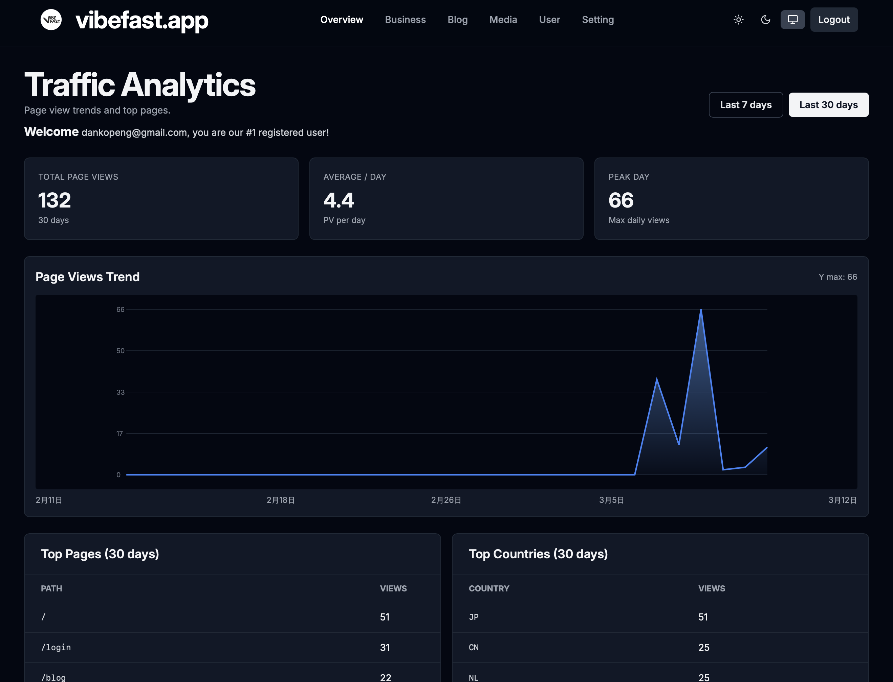

# VibeFast Docs

[中文](../zh/index-zh.md)

VibeFast is a Cloudflare-native product starter built for developers and founders who want to launch SaaS products, content products, tool sites, or commercial web apps with an admin layer much faster.

This section is public product documentation. It explains what the product is and why it is useful, without turning the public repo into a full private buyer manual.

## What you can find here

- a public quickstart view of the product
- why the stack is built on full Cloudflare infrastructure
- why the project uses a monorepo structure
- a public FAQ about the product and purchase model
- the public changelog

## Recommended reading order

1. [Quickstart Guide](./quickstart.md)
2. [Why Cloudflare Fullstack](./why-cloudflare-fullstack.md)
3. [Why Monorepo](./why-monorepo.md)
4. [FAQ](./faq.md)
5. [Changelog](./changelog.md)

## Core message

VibeFast is not a loose pile of templates. It is a production-shaped baseline that already wires together a public site, content layer, media flow, commerce flow, admin experience, and analytics surface. You can rebrand it or use it as the starting point for your own product.

## Official links

- Main site: [vibefast.app](https://vibefast.app)
- Public learning resources: [Vibe Coding Docs](../../vibe-coding-docs/en/index.md)
