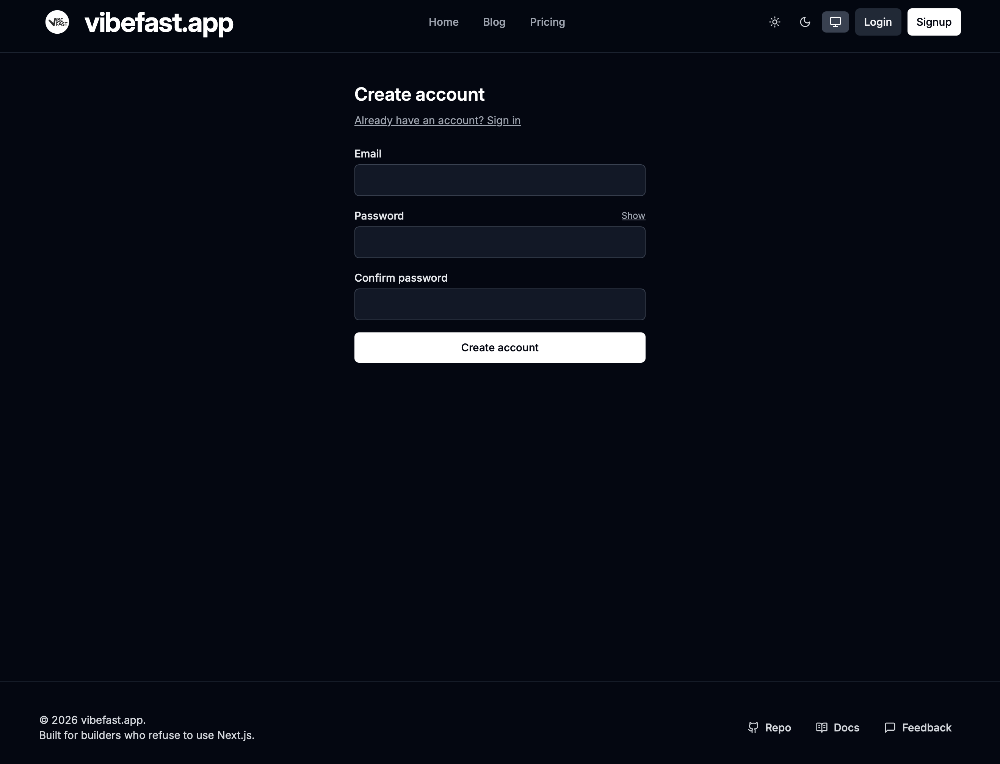
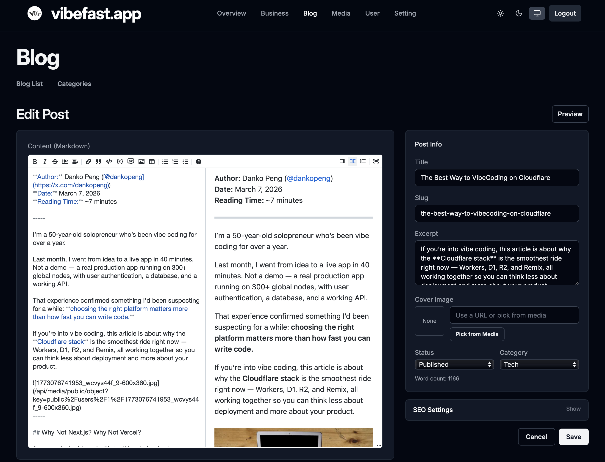
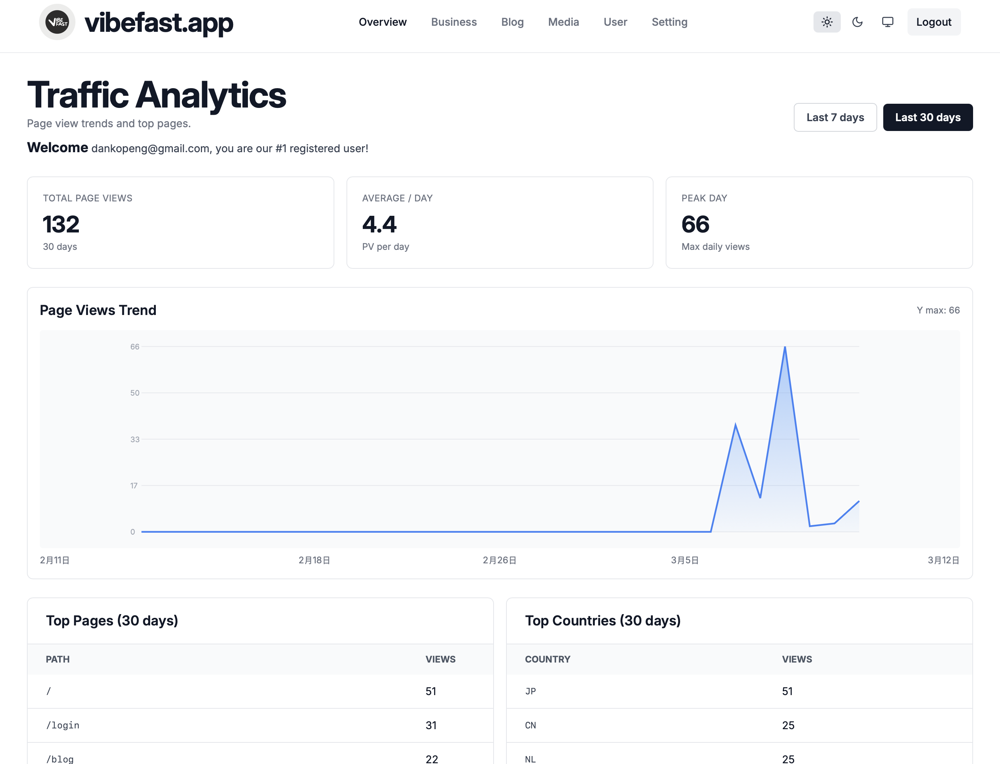

# VibeFast Quickstart

[中文](../zh/quickstart-zh.md) | [Back to index](./index.md)

**Updated:** March 2026  
**Reading time:** about 5 minutes

-----

## From Clone to Live in 3 Commands

```bash
git clone https://github.com/vibefast-app/vibefast.git my-app
cd my-app && npm install
npm run setup
```

That’s it.

`npm run setup` is the core of the VibeFast experience. It handles everything you’d otherwise do manually:

- Log into Cloudflare and verify your account
- Create a D1 database, run bootstrap SQL, build all tables automatically
- Generate a JWT secret and write it to your Workers environment
- Deploy both the frontend (Remix) and backend (Workers API) to production simultaneously

When the terminal finishes, you’ll see two live URLs — one for the frontend, one for the backend API. Your app is already running on Cloudflare’s global edge network across 300+ locations.

-----

## Requirements

Before you start, make sure you have:

- **Node.js 20+**
- **npm 10+**
- **A Cloudflare account** (free tier is enough)
- macOS users: `jq` installed (`brew install jq`)

No Cloudflare account yet? [Sign up free here](https://dash.cloudflare.com/sign-up) — no credit card required.

-----

## What You Can Do in the First Hour

VibeFast is designed with one goal: **buyers should be able to go from setup to a customized, live app within their first hour.**

### 0–10 Minutes: Install and Deploy

```bash
npm install
npm run setup
```

When this finishes, you have:

- A complete web app running on Cloudflare
- A D1 database with users, posts, and orders tables already created
- Frontend and backend Workers both live in production
- A URL you can open right now

### 10–15 Minutes: Local Development

```bash
npm run dev
```

One command starts both frontend and backend. Open the local URL printed in your terminal and you’ll see:

- A complete marketing homepage
- A pricing page
- A blog system
- User registration and login
- An admin dashboard entry point

These aren’t placeholder screens. Every feature is wired together and working.



### 15–40 Minutes: Stripe, Resend, and Branding

Add your Stripe API key and Resend API key to the config, run `npm run deploy`, then:

1. Register an account using your configured admin email
1. Open `/admin` and confirm you can access the dashboard
1. Run a Stripe test payment and confirm the webhook fires
1. Confirm the purchase confirmation and admin notification emails both arrive

Once the end-to-end flow works, your app is ready.

Branding is straightforward — VibeFast centralizes all the copy you’ll want to change in a single config file: site name, domain, pricing copy, homepage copy, SEO settings. Change them, run `npm run deploy`, everything updates.



-----

## Command Reference

|Command                  |What it does                                                             |
|-------------------------|-------------------------------------------------------------------------|
|`npm run setup`          |First-time setup: creates database, generates secret, deploys all Workers|
|`npm run dev`            |Start local development (frontend + backend simultaneously)              |
|`npm run deploy`         |Deploy to production (frontend + backend simultaneously)                 |
|`npm run deploy:frontend`|Deploy frontend only                                                     |
|`npm run deploy:backend` |Deploy backend only                                                      |
|`npm run build`          |Build all packages                                                       |
|`npm run typecheck`      |TypeScript type check across the entire project                          |

-----

## Want to See It Running First?

Don’t take the description at face value.

[vibefast.app](https://vibefast.app) is built entirely on VibeFast — the marketing homepage, blog, pricing page, user login, and dashboard are all real features from this template running in production.

**Sign up for a free account** and once you’re logged in, you’ll see:

- Real 7-day traffic data for the site
- Your registration number — which user you are

The auth flow you just went through, the dashboard UI, the page speed — that’s exactly what you’re buying. Not a demo. The real thing.



-----

## Want to Go Deeper on the Architecture?

- [Why Cloudflare Full-Stack?](./why-cloudflare-fullstack.md) — Direct comparison with Next.js + Vercel
- [Why a Monorepo?](./why-monorepo.md) — The practical benefits of the Turborepo setup

-----

## Ready?

**Early bird $99 — price goes up to $199 on June 1, 2026.**  
One-time payment. Lifetime access. Private GitHub repo. All future updates included.

👉 **[vibefast.app](https://vibefast.app)**
